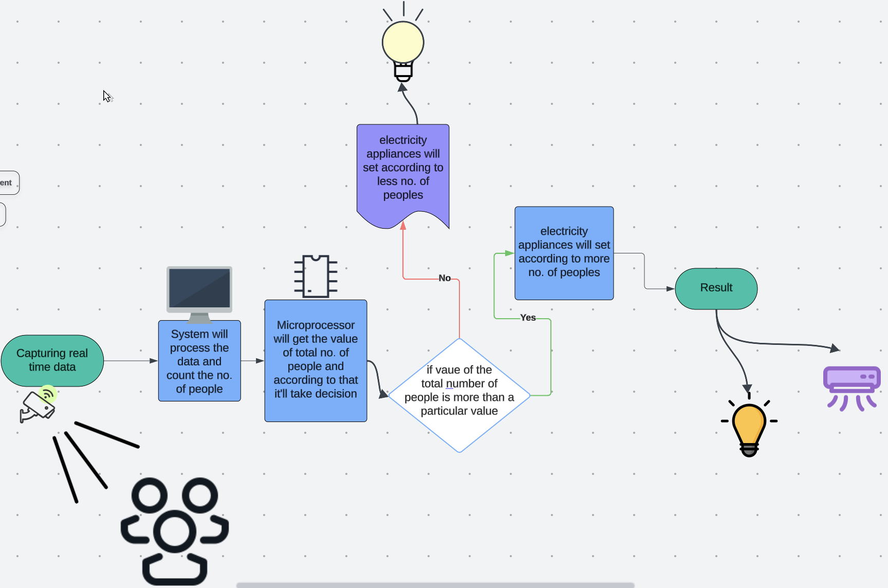

# Smart Automation using Body Detection

# Description:

This project is a smart solution aimed at optimizing energy consumption in classrooms by detecting occupancy and automatically controlling electrical appliances. The system employs a computer vision algorithm using the YOLOv8 model to detect the number of people in a classroom through a camera feed. The detected occupancy data is sent to a microcontroller (Arduino) via serial communication. Based on the data, the microcontroller turns appliances like lights, fans, or air conditioners on or off, ensuring efficient energy usage.

## Technologies Used:
•	Computer Vision: YOLOv8 for object detection.
 
•	Microcontroller: Arduino for appliance control.
 
•	Programming Languages: Python for the detection system and Arduino IDE for microcontroller programming.
 
•	Communication Protocol: Serial communication between Python and Arduino.
## Hardware:
•	A computer with a working webcam.
 
•	An Arduino connected to your computer.
 
•	Electric appliances connected to Arduino for control (optional).
## Software:
•	Python installed on your computer.
 
•	Required Python packages: serial, ultralytics, cv2, numpy

# Workflow

 
 # Setting Up the Environment
 
1.	Install Required Packages:
	 Run the following command in your terminal or command prompt to install dependencies
         
        Command : pip install pyserial ultralytics opencv-python-headless numpy

2.	Connect the Arduino:
	 
 •	Ensure your Arduino is connected via USB.
	 
 •	Replace '/dev/cu.usbserial-120' in the code with the appropriate port for your Arduino (e.g., COM3 for Windows).

3.	Prepare the YOLO Model:
	 
 •	Ensure you have the YOLOv8 model file (yolov8n.pt).
	 
 •	Download it from Ultralytics.

4.	Configure the Code:
	 
 •	Update the path to your YOLO model in the code:
     model = YOLO("yolov8n.pt")
   	
## Running the Code

1.	Start the Script:
         
Execute the script in your terminal:
         
Command : python /path/to/people_count.py

2.	Control the Camera:
	 
 •	The script will start your default webcam.
	 
 •	Ensure the camera is functional and the area being monitored is visible.

3.	Interacting with Arduino:
	 
 •	The code sends the smoothed count of people detected in the frame to the Arduino via serial communication.
	 
 •	The Arduino can then use this data to control appliances (modify your Arduino sketch to respond accordingly).

4.	Key Features in the Code:
         
 •	Object Detection:
         
        Detects “person” objects using YOLOv8 and filters detections to count people in the frame.
         
 •	Smoothing:
         
        Averages the count over the last 10 frames to reduce noise.
         
 •	Arduino Communication:
         
        Sends the smoothed count to Arduino using serial communication.
         
 •	Real-Time Display:
         
        Displays the video feed with bounding boxes for detected persons and the people count.

5.	Stopping the Script:
	 
 •	Press the q key to stop the program.
	 
 •	The program will release the camera resources and close the Arduino serial connection.

## Here are some ideas on how to implement it in different places effectively:
1. Educational Institutions
         
	•	Classrooms:
         
	•	Automatically control lights, fans, and air conditioners based on occupancy.
         
	•	Save energy when classrooms are empty during off hours.
         
	•	Libraries:
         
	•	Adjust lighting and cooling in sections with people.
         
	•	Display real-time occupancy data for efficient seating management.
2. Corporate Offices
         
	•	Meeting Rooms:
         
	•	Turn on projectors, lights, and AC when a room is in use.
         
	•	Send notifications if rooms are overcrowded or underutilized.
3. Hospitals
         
	•	Patient Rooms:
         
	•	Adjust lighting and temperature when a room is occupied.
         
	•	Notify staff when occupancy exceeds safety limits in waiting areas.
          
	•	Emergency Rooms:
         
	•	Manage energy use dynamically during peak hours.
